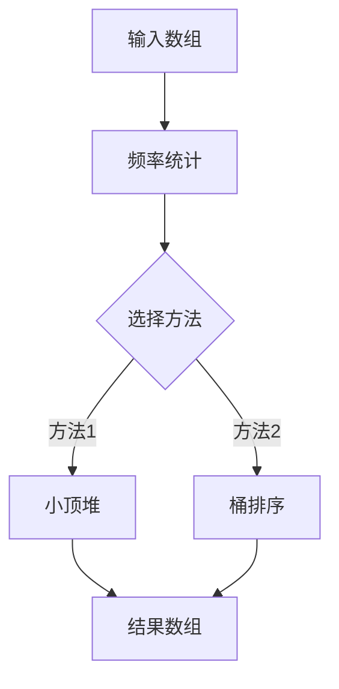

# 一网打尽！用堆和桶排序找出最受欢迎的前K个元素！

大家好，我是忍者算法。今天我们来攻克一道非常实用的题目 - LeetCode 347「前K个高频元素」。这个问题不仅在面试中常见，在实际工作中也经常遇到。让我们一起探索几种解决方案！

## 📚 生活中的场景

想象你是一个商场经理，想知道哪些商品最受欢迎。你手上有一串销售记录，需要找出销量前K名的商品。这就是我们今天要解决的问题的现实版本！

## 💡 问题定义

给你一个整数数组 nums 和一个整数 k，请你返回其中出现频率前 k 高的元素。

比如说：
```java
输入：nums = [1,1,1,2,2,3], k = 2
输出：[1,2]
解释：1出现了3次，2出现了2次，3出现了1次，所以前两个高频元素是1和2
```

## 🤔 解决方案

### 1. 小顶堆解法
```java
class Solution {
    public int[] topKFrequent(int[] nums, int k) {
        // 统计每个数字的频率
        Map<Integer, Integer> frequencyMap = new HashMap<>();
        for (int num : nums) {
            frequencyMap.put(num, frequencyMap.getOrDefault(num, 0) + 1);
        }
        
        // 创建一个小顶堆，按照频率排序
        PriorityQueue<Integer> heap = new PriorityQueue<>(
            (a, b) -> frequencyMap.get(a) - frequencyMap.get(b)
        );
        
        // 维护大小为k的小顶堆
        for (int num : frequencyMap.keySet()) {
            heap.offer(num);
            if (heap.size() > k) {
                heap.poll();
            }
        }
        
        // 构建结果数组
        int[] result = new int[k];
        for (int i = k - 1; i >= 0; i--) {
            result[i] = heap.poll();
        }
        
        return result;
    }
}
```

### 2. 桶排序解法（最优解）
```java
class Solution {
    public int[] topKFrequent(int[] nums, int k) {
        // 统计频率
        Map<Integer, Integer> frequencyMap = new HashMap<>();
        for (int num : nums) {
            frequencyMap.put(num, frequencyMap.getOrDefault(num, 0) + 1);
        }
        
        // 创建桶
        List<Integer>[] buckets = new ArrayList[nums.length + 1];
        for (int i = 0; i < buckets.length; i++) {
            buckets[i] = new ArrayList<>();
        }
        
        // 将数字放入对应频率的桶中
        for (int num : frequencyMap.keySet()) {
            int frequency = frequencyMap.get(num);
            buckets[frequency].add(num);
        }
        
        // 从后往前收集k个元素
        List<Integer> result = new ArrayList<>();
        for (int i = buckets.length - 1; i >= 0 && result.size() < k; i--) {
            result.addAll(buckets[i]);
        }
        
        // 转换为数组返回
        return result.stream().mapToInt(i -> i).limit(k).toArray();
    }
}
```

## 📝 方法比较

1. **小顶堆法**
   - 时间复杂度：O(nlogk)
   - 空间复杂度：O(n)
   - 优点：适合处理动态数据
   - 缺点：需要额外的堆空间

2. **桶排序法**
   - 时间复杂度：O(n)
   - 空间复杂度：O(n)
   - 优点：最优的时间复杂度
   - 缺点：需要额外的桶空间

## 💡 算法思路解析

### 小顶堆法的思路：
1. 先用哈希表统计每个元素的频率
2. 维护一个大小为k的小顶堆
3. 遍历频率表，更新堆
4. 最后堆中剩下的就是前k个高频元素

### 桶排序法的思路：
1. 同样先统计频率
2. 创建n+1个桶（频率范围是0到n）
3. 根据频率把元素放入对应的桶
4. 从后往前收集k个元素

## 🎯 易错点提醒

1. **频率统计**
   - 别忘了先统计频率
   - 使用HashMap的getOrDefault方法更简洁

2. **堆的比较器**
   - 小顶堆要按频率比较，不是数字本身
   - lambda表达式注意参数顺序

3. **结果收集**
   - 注意收集够k个元素就停止
   - 桶可能为空，要跳过

## 🎨 数据结构图解



## 🌟 面试技巧

1. **先说思路**
   - "我们首先需要统计每个元素的频率"
   - "然后可以用小顶堆或桶排序来找出前k个"

2. **比较方法**
   - 分析各种方法的优缺点
   - 说明在不同场景下的选择

3. **补充优化**
   - 提到空间优化的可能性
   - 讨论处理动态数据的方案

## 🎩 延伸应用

这个问题在实际工作中有很多应用：

1. **热门商品分析**
   - 找出销量最高的商品
   - 实时监控热销商品

2. **网站访问统计**
   - 统计最常访问的页面
   - 分析用户行为模式

3. **系统监控**
   - 发现最频繁的错误类型
   - 优化系统性能瓶颈

---
作者：忍者算法
公众号：忍者算法
🎁 回复【刷题清单】获取LeetCode高频面试题合集
🧑‍💻 回复【代码】获取多语言完整题解
💡 回复【加群】加入算法交流群，一起进步
#算法面试 #LeetCode #堆 #桶排序

这道题告诉我们：有时候换个思路，用不同的数据结构，可以得到更优的解法。如果你对这个话题还有任何疑问，欢迎在评论区讨论！